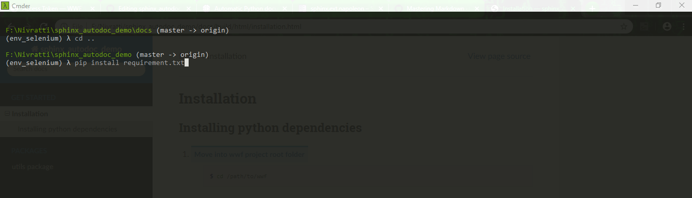

************
Installation
************

Installing python dependencies
------------------------------

1. Move into wwf project root folder
    .. code:: console

        $ cd /path/to/wwf

2. Install all python dependencies using
    .. code:: console

        $ pip install requirement.txt

3. It looks like

